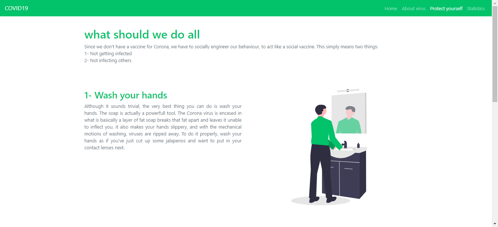
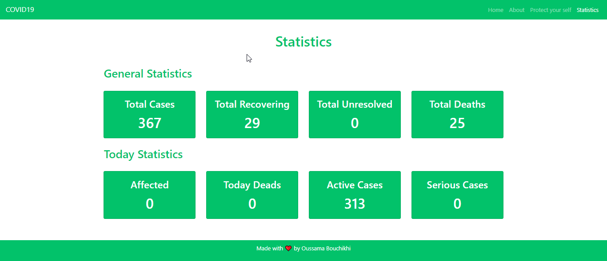
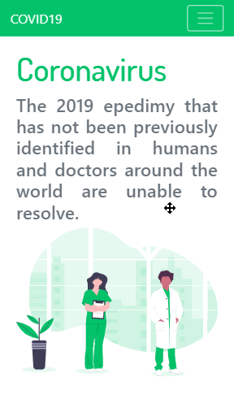
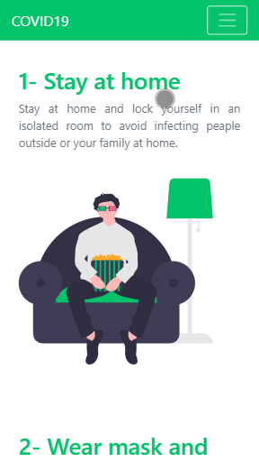
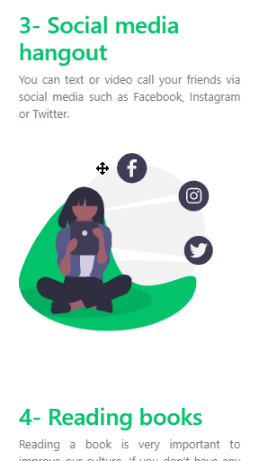

# COVID19
<br><br>
My project for the online hackathon under the theme COVID19

## Screenshots
<br>
<br>
<br>
<br>


<br>

## Tools & Languages
  - HTML5
  - CSS3
  - Javascript
  - Assets are from [undraw](https://undraw.co/illustrations) & [flaticon](https://www.flaticon.com/)
  - [COVID API](https://thevirustracker.com/) corona virus statistics api
  - [VSCode](https://code.visualstudio.com/) as a text editor
  
## Contributing
Pull requests are welcome feel free to ```fork``` this repo.

## License
This project is open sourced under the [MIT](https://opensource.org/licenses/MIT) license.
